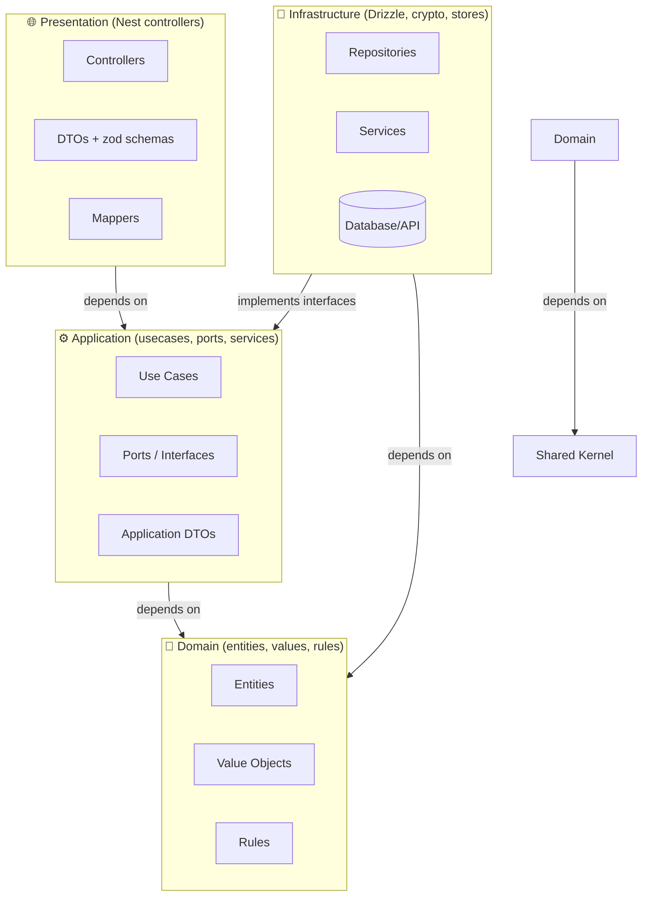
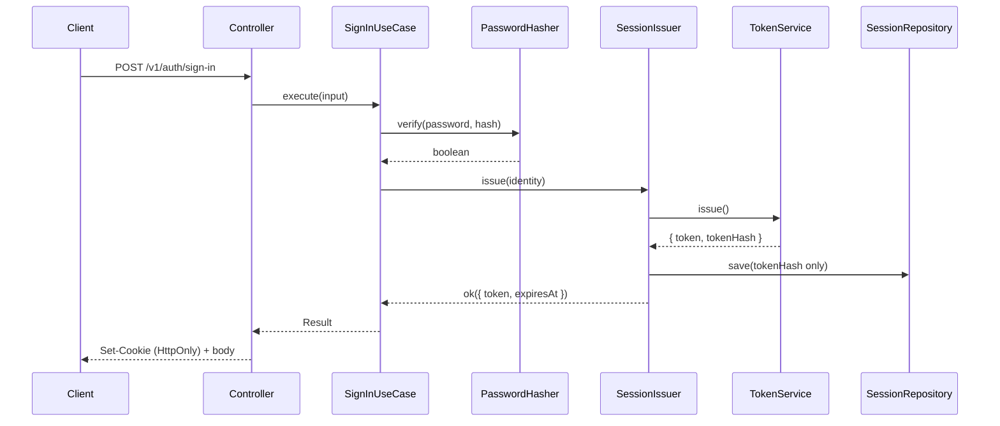

# Backend Handbook — NestJS + Feature-First Clean Architecture

This handbook captures the architectural choices, design patterns, and
technology stack for backend services in this monorepo: **NestJS on Fastify,
organized Feature-First with Clean Architecture layers**, validated with zod,
persisted with Drizzle, and hardened with typed `Result` error handling.

It is a *reference*, written with placeholder examples — mirror the shapes, not
the specific symbols.

---

## Table of Contents

1. [Overview](#1-overview)
2. [Project Structure](#2-project-structure)
3. [Clean Architecture Principles](#3-clean-architecture-principles)
4. [The Four Layers Explained](#4-the-four-layers-explained)
5. [Shared Kernel & the Result Type](#5-shared-kernel--the-result-type)
6. [Dependency Injection & Composition Root](#6-dependency-injection--composition-root)
7. [Validation with zod](#7-validation-with-zod)
8. [Error Handling to the Edge](#8-error-handling-to-the-edge)
9. [Persistence & Rehydration](#9-persistence--rehydration)
10. [Authentication & Sessions](#10-authentication--sessions)
11. [Testing Strategy](#11-testing-strategy)
12. [Naming & Boundary Rules](#12-naming--boundary-rules)
13. [Technology Stack](#13-technology-stack)

---

## 1. Overview

This project uses **Feature-First Clean Architecture on NestJS**:

- **Feature-First**: Code is organized by business features (`auth`, `users`,
  `posts`) rather than technical layers (`controllers/`, `services/`, `models/`).
- **Clean Architecture**: each feature is a vertical slice split into
  `domain / application / infrastructure / presentation`, with dependencies
  pointing inward only.
- **NestJS is the adapter, not the soul**: Nest provides dependency injection
  and HTTP routing in the outer layers. Domain and application code are plain
  TypeScript classes with **zero NestJS imports**.
- **Errors are values**: use cases return a typed `Result<T, E>`, never throw.
  A single filter maps `Error` values to HTTP responses.

### Why Feature-First on Nest?

NestJS defaults to layer-first (`controllers/`, `services/`, `modules/`). That
scatters one feature across many folders and makes a single change touch four
directories. Feature-first keeps everything about a capability in one place:

```
❌ Layer-first (what Nest scaffolds by default)
src/
├── controllers/        # AuthController, UserController, PostController
├── services/           # AuthService, UserService, PostService
├── entities/           # User, Post
└── modules/            # AuthModule, UserModule, PostModule

✅ Feature-first (what we do)
src/
└── features/
    ├── auth/           # everything about authentication
    │   ├── domain/  application/  infrastructure/  presentation/
    ├── users/          # everything about users
    └── posts/          # everything about posts
```

**Benefits**: fix login → go to `features/auth`; a feature is self-contained and
can be understood, tested, and handed to a team as a unit.

---

## 2. Project Structure

```
backend/
  src/
    main.ts                      # Process entry (env → migrate → listen)
    bootstrap/                   # Composition root / app wiring
      create-app.ts              # NestFactory + adapter + global filters/pipes
      app.module.ts              # imports every feature module

    shared/                      # Shared Kernel & cross-cutting concerns
      kernel/                    # pure domain core, zero dependencies
        types/                   # Result, Brand (branded ids)
        errors/                  # AppError
        rules/                   # global rules (validateName)
      application/               # shared ports & DTOs (no impl)
        interfaces/              # ILogger, IIdGenerator, IDateProvider, IUnitOfWork
        dtos/                    # shared DTOs (Pagination)
      infrastructure/            # shared concrete impls
        db/                      # Drizzle instance, schema, migrations
        logging/                 # ConsoleLogger
        ids/                     # UuidGenerator
        config/                  # env loading
      presentation/              # shared HTTP adapters
        guards/                  # SessionGuard, AdminGuard
        filters/                 # AppErrorFilter
        pipes/                   # validation pipe

    features/
      auth/
        domain/                  # business rules (no framework, no DB)
          entities/              # Session
          values/                # Email, Password
          rules/                 # passwordRules, roleRules
        application/             # use cases, ports, DTOs
          ports/                 # IUserRepository, IPasswordHasher, ISessionRepository
          usecases/              # SignUp, SignIn, SignOut, GetSession
          services/              # SessionIssuer
          dtos/                  # SignUpInput, SignUpOutput
        infrastructure/          # implements ports with concrete tech
          repositories/          # DrizzleUserRepository
          mappers/               # UserMapper (row → entity, via restore)
          services/              # ScryptPasswordHasher, JwtTokenService
        presentation/            # transport adapters (Nest)
          http/
            auth.controller.ts
            dtos/                # request/response shapes + zod schemas
            mappers/             # AuthMappers
        auth.module.ts           # feature composition root (DI)
      users/
        domain/  application/  infrastructure/  presentation/
      posts/
        domain/  application/  infrastructure/  presentation/

  migrations/                    # Drizzle SQL migrations
  test/                          # e2e / integration only
    auth-flow.spec.ts

  package.json  tsconfig.json  docker-compose.yml
```

### Key directories

- **`src/main.ts`** — the only file that reads `PORT`/`HOST` and binds the
  socket. Reads env, runs migrations, calls `createApp()`, listens. Kept thin so
  tests import `createApp` without opening a port.
- **`src/bootstrap/`** — the "clean factory". `createApp()` builds the Nest app:
  registers the adapter, global error filter, validation pipe, cookie plugin,
  and CORS. `app.module.ts` wires all feature modules.
- **`src/shared/kernel/`** — pure domain core shared across features (`Result`,
  `AppError`, branded ids). Zero dependencies; any feature may use it; it may
  not import a feature.
- **`src/features/{feature}/`** — each self-contained slice. The `*module.ts`
  at its root is the *only* file that knows Nest for that feature: it binds
  ports to implementations and declares controllers.
- **`src/shared/application/`** — cross-feature *ports* (interfaces) and DTOs.
  **`src/shared/infrastructure/`** — their concrete implementations (Drizzle,
  loggers, id generators, config).
- **`src/shared/presentation/`** — shared Nest adapters: guards, filters, pipes.

---

## 3. Clean Architecture Principles

One rule governs everything:

> **Dependencies only point inward. Inner layers know nothing about outer layers.**



- **Domain** → Shared Kernel only.
- **Application** → Domain + Shared Kernel.
- **Infrastructure** → Application (implements ports) + Domain.
- **Presentation** → Application (injects use cases); type/const imports from
  Domain are allowed, runtime class imports are not.

**Control flow vs dependency flow** — the two arrows go opposite directions at
the DB boundary:

```
Control:     HTTP → Controller → UseCase → Repository → DB → Repository → UseCase → Controller → HTTP
Dependency:  Controller → UseCase → Domain ← implements ← Repository
```

This is the **Dependency Inversion Principle** in practice: application defines
the interfaces (ports); infrastructure implements them (adapters); the use case
never names a concrete repository.

---

## 4. The Four Layers Explained

### 🌐 Presentation (NestJS)

**Role**: translate HTTP into use-case operations and back.

| Responsibility | Example |
| -------------- | ------- |
| Parse & validate request | `@Body({ schema: signUpSchema })` |
| Map transport → use-case DTO | `AuthMappers.toSignUpInput(body)` |
| Invoke a use case | `return this.signUp.execute(input)` |
| Translate `Result` → HTTP | global `AppErrorFilter` |

```typescript
@Controller("auth")
export class AuthController {
  constructor(@Inject(SignUpUseCase) private readonly signUp: SignUpUseCase) {}

  @Post("sign-up/email")
  @HttpCode(201)
  async signUp(
    @Body({ schema: signUpSchema }) input: SignUpRequest,
  ): Promise<AuthResponse> {
    // 1. zod already validated the body (see §7)
    // 2. map to the use-case DTO, call the use case
    // 3. the AppErrorFilter maps Result/AppError → problem+json
    return await this.signUp.execute(AuthMappers.toSignUpInput(input));
  }
}
```

**Does NOT belong**: business rules, DB queries, orchestration, external API
calls, entity construction.

### ⚙️ Application

**Role**: define what the app can do and orchestrate — the capability list.

```typescript
export class SignUpUseCase {
  constructor(
    private readonly users: IUserRepository,     // port (interface)
    private readonly hasher: IPasswordHasher,    // port (interface)
    private readonly idGenerator: IIdGenerator,
    private readonly dateProvider: IDateProvider,
    private readonly uow: IUnitOfWork,
  ) {}

  async execute(input: SignUpInput): Promise<Result<SignUpOutput, AppError>> {
    const email = Email.create(input.email);
    if (email.isErr()) return err(email.error);

    const password = Password.create(input.password);
    if (password.isErr()) return err(password.error);

    return this.uow.runInTransaction(async () => {
      if (await this.users.emailExists(email.value)) {
        return err(AppError.conflict("User already exists"));
      }
      const user = User.create(
        make<UserId>(this.idGenerator.generate()),
        email.value,
        await this.hasher.hash(password.value.value),
        this.dateProvider.now(),
      );
      await this.users.save(user.value);
      return ok({ id: user.value.id, email: user.value.email.value });
    });
  }
}
```

**Ports** — interfaces defined here, implemented in infrastructure:

```typescript
// application/ports/i-user-repository.ts
export interface IUserRepository {
  findById(id: UserId): Promise<User | null>;
  findByEmail(email: Email): Promise<User | null>;
  save(user: User): Promise<void>;
  update(id: UserId, data: UpdateUserData): Promise<User>;
}
```

**Does NOT belong**: HTTP concerns, DB queries, framework imports, external APIs.

### 💎 Domain

**Role**: express business concepts and rules in pure TypeScript.

```typescript
export class Email {
  private constructor(public readonly value: string) {}

  // Factory for NEW values — runs validation, returns a Result
  static create(email: string): Result<Email, AppError> {
    if (!email.includes("@")) return err(AppError.validation("Invalid email"));
    return ok(new Email(email));
  }

  // Factory for TRUSTED data — bypasses validation (see §9)
  static restore(email: string): Email {
    return new Email(email);
  }
}

export class PasswordRules {
  static readonly MIN_LENGTH = 8;
  static validate(p: string): { valid: boolean; errors: string[] } {
    const errors = p.length < this.MIN_LENGTH ? ["Too short"] : [];
    return { valid: errors.length === 0, errors };
  }
}
```

**Rules**: value objects use a `private constructor` + `static create()`.
Entities use `create()` (validate) and `restore()` (bypass) factories. Zero
framework imports.

### 🔧 Infrastructure

**Role**: implement the ports with concrete technology.

```typescript
export class DrizzleUserRepository implements IUserRepository {
  constructor(@Inject(DATABASE) private readonly db: Database) {}

  async findByEmail(email: Email): Promise<User | null> {
    const row = await this.db
      .select()
      .from(users)
      .where(eq(users.email, email.value))
      .limit(1);
    return row[0] ? UserMapper.toDomain(row[0]) : null;
  }
}
```

**Does NOT belong**: business rules or orchestration. A repository that runs
validation or triggers emails is a defect — that is the use case's job.

---

## 5. Shared Kernel & the Result Type

### Shared kernel (`shared/kernel/`)

Pure, dependency-free building blocks any feature may use:

| File | Contents |
| ---- | -------- |
| `types/result.ts` | `Result`, `ok`, `err` |
| `types/brand.ts`  | `Brand<T, K>` + `make()` — branded ids |
| `errors/app-error.ts` | `AppError` — framework-agnostic error type |

### Result

Every use case and domain factory returns `Result<T, AppError>`:

```typescript
import { err, ok } from "@/shared/kernel/types/result";
import type { Result } from "@/shared/kernel/types/result";

const email = Email.create(input.email);
if (email.isErr()) return err(email.error);
// … email.value is now a valid Email
```

Branch with `isErr()` / `isOk()`; unwrap with `.value` / `.error`. **Errors are
values — they flow, they never throw.**

### Branded ids

Prevent passing a user id where a post id is expected:

```typescript
type UserId = Brand<string, "UserId">;
type PostId = Brand<string, "PostId">;

// construction only at trust boundaries (id generators, mappers):
const id = make<UserId>(generator.generate());
```

### AppError

```typescript
AppError.validation(message, details?)  // 422
AppError.notFound(resource)              // 404
AppError.unauthorized(message?)          // 401
AppError.forbidden(message?)             // 403
AppError.conflict(message)               // 409
```

Each carries a stable `code` that the filter maps to a status and the client
surfaces verbatim.

---

## 6. Dependency Injection & Composition Root

NestJS is the DI container, but the wiring is contained so the rest of the app
stays framework-agnostic.

### Feature composition root: `{feature}.module.ts`

Each feature exports a `@Module()` that (1) imports the modules its controllers
need, (2) **binds ports to implementations** via the port class + `useClass`,
and (3) registers use cases, services, and controllers:

```typescript
@Module({
  imports: [UserModule],
  providers: [
    { provide: IUserRepository, useClass: DrizzleUserRepository },
    { provide: IPasswordHasher, useClass: ScryptPasswordHasher },
    { provide: ISessionRepository, useClass: DrizzleSessionRepository },
    SignUpUseCase,
    SignInUseCase,
    SessionIssuer,
    AuthController,
  ],
})
export class AuthModule {}
```

Ports are *abstract classes* upstream (`IUserRepository`) — the class is both
the type and its DI token, so there is no separate token constant.
Infrastructure classes take collaborators via `@Inject(IPortName)` (explicit
`@Inject` everywhere because the build keeps `emitDecoratorMetadata` off).
Non-class values keep SCREAMING_SNAKE string tokens: `DATABASE` (drizzle
client), `CONFIG` (validated `Env`), `ADMIN_EMAILS` (`ReadonlySet<string>`),
`SESSION_COOKIE_SECURE` (`boolean`).

### Application composition root: `bootstrap/`

`app.module.ts` imports every feature module; `create-app.ts` builds the app and
configures the **outer adapter**: Fastify adapter, URI versioning (`/v1`),
cookie plugin, gzip, CORS (`origin: webOrigin`, `credentials: true`), the global
`AppErrorFilter`, and the global validation pipe.

### The dirty entry point: `main.ts`

```typescript
import { createApp, loadEnv, runMigrations } from "@/index";

const env = loadEnv();
await runMigrations(env.DATABASE_URL);
const app = await createApp({ env });
await app.listen({ port: env.PORT, host: "0.0.0.0" });
```

---

## 7. Validation with zod

Request validation uses **zod schemas** at the presentation boundary, enforced
by a shared `ValidationPipe`:

```typescript
// presentation/http/auth-schemas.ts
import { z } from "zod";

export const signUpSchema = z.object({
  name: z.string().trim().min(1).max(100),
  email: z.string().email(),
  password: z.string().min(8),
});
export type SignUpRequest = z.infer<typeof signUpSchema>;
```

Controllers opt in per route with `@Body({ schema })`. A failed schema becomes a
`ValidationFailed` problem+json body.

**Distinction that matters** (see §4):

- **Transport validation** (zod): *is the body well-formed?* — controller.
- **Business rules** (domain VOs): *is this value acceptable?* — domain.

Do not duplicate one as the other.

---

## 8. Error Handling to the Edge

The error contract is uniform end-to-end:

```
use case returns Result<T, AppError>  →  AppErrorFilter  →  RFC 7807 problem+json
```

`AppErrorFilter` (global, in `shared/presentation`):

- `Ok(value)` → `200`/`201` (or `204` for `void`) + value.
- `Err(AppError)` → mapped status with a `problem+json` body:

```json
{
  "code": "Conflict",
  "title": "Conflict",
  "status": 409,
  "message": "User already exists",
  "details": { "issues": [{ "path": ["email"], "message": "…" }] }
}
```

Clients read `body.code` / `body.message`. **Never** throw HTTP-shaped errors in
application code — return `err(AppError.notFound("Post"))`. Only genuinely
unexpected bugs escape the Result model and fall to Nest's 500 handler.

---

## 9. Persistence & Rehydration

- **Centralized shared schema**: Drizzle tables live once in
  `shared/infrastructure/db/schema/` — features share one Postgres database and
  reference each other by FK. Features do not own private table sets.
- **Repository boundary**: only `infrastructure/repositories/*` touch the Drizzle
  `Database`. Mappers convert rows → domain entities.
- **Unit of work**: multi-write use cases run inside `IUnitOfWork.runInTransaction`
  (a request-scoped transaction), depending on the interface — never on Drizzle.

### The Rehydration Rule (strict)

Mappers must rebuild entities with **`restore()`, never `create()`**:

```typescript
// infrastructure/mappers/user-mapper.ts
export class UserMapper {
  static toDomain(row: UserRow): User {
    // STRICT: restore(), not create(). DB data is trusted; business rules may
    // have changed since the row was written, and re-validating could break
    // loading legacy records.
    return User.restore(row.id, Email.restore(row.email), row.passwordHash, …);
  }
}
```

`create()` = validate new data. `restore()` = bypass validation for trusted data.

---

## 10. Authentication & Sessions

Cookie-session auth (not bearer-JWT-in-a-header by default):

| Piece | Where | Role |
| ----- | ----- | ---- |
| `Session` entity | `auth/domain/entities/` | domain session + TTL |
| `WebCryptoSessionTokenService` | `auth/infrastructure/` | mints token + token hash |
| `ScryptPasswordHasher` | `auth/infrastructure/` | `IPasswordHasher` |
| `SessionIssuer` | `auth/application/` | issues + persists + derives role |
| `SessionGuard` / `AdminGuard` | `shared/presentation/` | protect routes |
| `cookie.ts` helpers | `shared/presentation/` | session cookie name + secure flag |



**Security rules**: only the **token hash** is stored (the raw token exists at
issuance and in the cookie, nowhere else); `role` is **derived** at session time
from configured admin emails, never persisted; the cookie is `HttpOnly`,
`Secure` in production.

---

## 11. Testing Strategy

Unit tests live **next to the code** as `*.test.ts`, run with vitest.

| Layer | What to test | How |
| ----- | ------------ | --- |
| Domain | entities, rules, VOs | pure unit tests |
| Application | use cases, services | inject **in-memory fakes** of the ports |
| Infrastructure | hashers, mappers, stores | real implementation, replaced env (e.g. local bucket) |
| Shared presentation | filter, pipes | unit tests |

Fakes live in the same layer they replace (e.g. `application/testing/mocks.ts`).
Prefer hand-written in-memory fakes over a mocking framework so use-case tests
stay deterministic and dependency-free:

```typescript
const uow = new TestUnitOfWork();
const users = new InMemoryUserRepository();
const u = new SignUpUseCase(users, new FakePasswordHasher(), idGen, date, uow);

const res = await u.execute({ email: "a@b.co", password: "StrongPass1" });
expect(res.isOk()).toBe(true);
expect(users.saved[0].email.value).toBe("a@b.co");
```

---

## 12. Naming & Boundary Rules

### File naming (kebab-case)

| Kind | File | 
| ---- | ---- |
| Use case | `sign-up.ts` |
| Port | `i-user-repository.ts` |
| Entity / VO / rule | `user-entity.ts`, `email-vo.ts` |
| Repository / service | `drizzle-user-repository.ts`, `scrypt-password-hasher.ts` |
| Controller | `auth.controller.ts` |
| Module | `auth.module.ts` |

### Symbol naming

| Symbol | Suffix |
| ------ | ------ |
| Use case | `SignUpUseCase` |
| Entity | `UserEntity` |
| Value object | `EmailVO` |
| Port interface | `IUserRepository` |
| Controller | `AuthController` |
| Domain service | `SessionIssuer`, `PasswordRules` |

> Follow the project's Language/`naming.md` vocabulary (e.g. **Blog** not
> "post", **SessionUser** = request principal). Use the established terms.

### Enforced bounds

An oxlint rule rejects illegal cross-layer imports. The boundaries encode:

- `domain/` → only `shared/kernel` + stdlib.
- `application/` → `domain/` + `shared/kernel` + `shared/application`.
- `infrastructure/` → `application/`, `domain/`, `shared/*`.
- `presentation/` → `application/`, `shared/*`; never a sibling feature's
  internals, never its own infra, and never another feature's `domain` at
  runtime (type-only domain imports allowed).
- `@nestjs/*` and `drizzle-orm` appear only in presentation / infrastructure /
  module wiring.

Rule of thumb: **if an import would make an inner layer depend on an outer one,
move the contract up into `application/` (ports) and implement it in
`infrastructure/`.**

---

## 13. Technology Stack

| Concern    | Choice                                       |
| ---------- | -------------------------------------------- |
| Runtime    | Bun                                          |
| API        | NestJS on Fastify                            |
| Validation | zod                                          |
| DB         | Postgres + Drizzle ORM, migrations           |
| Storage    | S3-compatible object store (presigned URLs)  |
| Sessions   | HttpOnly cookie; scrypt; random token + hash |
| Errors     | `better-result` `Result` + `AppError` + problem+json filter |
| DI         | NestJS modules + port tokens                 |
| Tests      | vitest, next-to-code `*.test.ts`              |
| Tooling    | oxlint (incl. layer-import bounds), `tsc --noEmit` |

---

_This is a living reference: keep it shallow, correct, and generic. The
placeholders are shapes, not contracts — name things for your domain, but keep
the layer, DI, and error-flow structures exactly as drawn above._