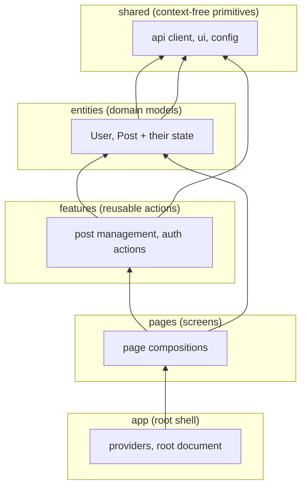
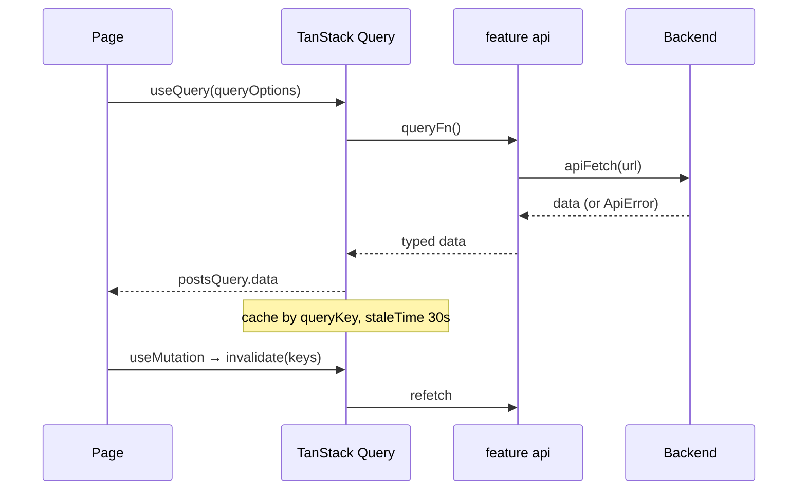

# Frontend Handbook — TanStack + Feature-Sliced Design

This handbook captures the architectural choices, design patterns, and
technology stack for the web application in this monorepo: **React 19 on
TanStack Start (file-based routing) + TanStack Query for server state, MUI for
the design system, organized Feature-Sliced-ish (FSD)**. The FSD methodology is
documented at [feature-sliced.design](https://feature-sliced.design/).

It is a *reference*, written with placeholder examples — mirror the shapes, not
the specific symbols.

---

## Table of Contents

1. [Overview](#1-overview)
2. [Project Structure](#2-project-structure)
3. [Feature-Sliced Principles](#3-feature-sliced-principles)
4. [Routing & Pages](#4-routing--pages)
5. [Pages & UI Composition](#5-pages--ui-composition)
6. [Features: API, Queries, Mutations](#6-features-api-queries-mutations)
7. [Shared Layer](#7-shared-layer)
8. [Server State with TanStack Query](#8-server-state-with-tanstack-query)
9. [Design System & Shared UI](#9-design-system--shared-ui)
10. [Auth & Session Handling](#10-auth--session-handling)
11. [Naming & Boundary Rules](#11-naming--boundary-rules)
12. [Testing Strategy](#12-testing-strategy)
13. [Technology Stack](#13-technology-stack)

---

## 1. Overview

The web app is a **TanStack Start single-page application**: React 19 +
TypeScript, file-based routing through the TanStack Router, server state managed
by TanStack Query, and a MUI + Emotion design system.

Three ideas shape the code:

- **File-based routing**: a URL `/blog/my-post` is declared by a file
  `routes/blog.$slug.tsx`, not registered imperatively. The route tree is
  generated; routes *point at* page components.
- **Feature-Sliced-ish layering**: folders express a strict dependency direction
  (`app → pages → features → entities → shared`). Something lives in the
  innermost layer that can host it.
- **Server state is a first-class layer**: data fetching is declarative
  (`queryOptions`), not imperative `useEffect` + `fetch`.

```
TanStack Start
  └─ src/
       ├─ routes/*.tsx        # URL → page mapping (file-based)
       ├─ pages/*             # screen compositions (the "what you see")
       ├─ features/*          # reusable user actions (api + queries + mutations + hooks)
       ├─ entities/*          # domain models + their session/state (User, Post)
       ├─ shared/             # api client, auth client, config, primitives
       └─ app/                # root shell: providers, root document, router
```

---

## 2. Project Structure

```
web/
  src/
    router.tsx                # createRouter({ routeTree, defaultPreload: "intent" })
    routeTree.gen.ts          # GENERATED from routes/ — do not edit

    routes/                   # file-based routes (TanStack Router)
      __root.tsx              # root layout: wraps app in providers
      index.tsx               # /
      blog.$slug.tsx          # /blog/:slug
      auth.tsx                # /auth (sign in / up)
      admin.tsx               # /admin (layout shell + guards)
      admin.index.tsx         # /admin (dashboard)
      admin.blog.new.tsx      # /admin/blog/new
      admin.blog.$id.edit.tsx # /admin/blog/:id/edit

    pages/
      blog-page/
        index.ts              # public barrel: re-exports BlogPage, PostDetailPage
        ui/
          blog-page.tsx       # blog list screen
          post-detail-page.tsx  # a single post
      auth-page/
        ui/auth-page.tsx      # sign in / up screen
      admin-page/
        ui/                   # admin-posts-page, post-editor, new/edit pages

    features/
      manage-posts/           # reusable post admin capability
        api/
          post-api.ts         # typed HTTP client for /v1/posts
          post-queries.ts     # queryOptions (list, detail, categories)
          post-mutations.ts   # useCreatePost, useUpdatePost, useRemovePost
          upload-image.ts     # media upload (presigned)
        index.ts              # public barrel
      README.md               # extraction-rule note (2+ consumers → move in)

    entities/
      user/
        index.ts
        model/
          session.tsx         # user session context/state
      README.md

    shared/
      api/
        client.ts             # apiFetch<T>, ApiError, Page<T>
        post.ts               # Post, CategoryRef types
        user.ts               # User type
      auth/
        auth-client.ts        # signIn/signUp/signOut/getSession
      config/
        env.ts                # API_ORIGIN, etc.
      README.md

    app/
      shell/
        query-provider.tsx    # QueryClient provider (staleTime 30s)
        root-document.tsx     # HTML shell

  packages/ui/                # shared design system (consumed by web)
    src/
      theme.ts                # MUI theme tokens
      components/             # Page, Form, MarkdownEditor, MarkdownView
      providers/
        ui-provider.tsx       # ThemeProvider / Emotion + MUI + Tiptap
      index.ts
```

---

## 3. Feature-Sliced Principles

FSD organizes code into layers with a **strict dependency direction** —
anything may import from the layers *below* it, never *above*:



**The layer ladder — put code in the innermost layer that can host it:**

| If it's…                                   | It lives in |
| ------------------------------------------ | ----------- |
| A URL → component mapping                  | `routes/`   |
| A screen composition                       | `pages/`    |
| A **reusable user action** (2+ consumers)  | `features/` |
| A domain model + its state (User, Post)    | `entities/` |
| Generic, context-free (fetch, ui, config)  | `shared/`   |

**The extraction rule** (documented in `features/README.md`): single-consumer
code stays in its page; move it into `features/` only when **2+ real consumers
use it, it has an independent reason to change, and it has a focused
responsibility**. Empty layer folders are a deliberate state, not a gap — see
the READMEs (`features/`, `widgets/`) before "filling" them.

> `widgets/` is officially discouraged in FSD v2.1; screen compositions live in
> `pages/`. Do not create widgets unless there's a documented reason.

### Dependency rules

- ✅ `pages` may import `features`, `entities`, `shared`.
- ✅ `features` may import `entities`, `shared`.
- ✅ `entities` may import `shared`.
- ✅ `shared` imports nothing from the app.
- ❌ No layer imports from a layer above it. A page must not reach past a
  feature into another page; a feature must not import a page.

---

## 4. Routing & Pages

### The router

```typescript
// router.tsx
import { createRouter } from "@tanstack/react-router";
import { routeTree } from "./routeTree.gen";

export function getRouter() {
  return createRouter({
    routeTree,
    defaultPreload: "intent",
    scrollRestoration: true,
  });
}
```

- The route tree (`routeTree.gen.ts`) is **generated** from `routes/*.tsx` —
  edit route files, never the generated file.
- `defaultPreload: "intent"` prefetches route data when the user hovers a link.
- `scrollRestoration: true` preserves scroll across navigation.

### File → URL mapping

| File | URL |
| ---- | --- |
| `routes/index.tsx` | `/` |
| `routes/blog.$slug.tsx` | `/blog/:slug` |
| `routes/admin.blog.$id.edit.tsx` | `/admin/blog/:id/edit` |

Dynamic segments use a **leading `$`**: `$slug`, `$id`. Nested routes use
folder or dot notation (`admin.blog.new.tsx`).

### Route → page

A route file is thin: it declares the route's params and renders the page
component. All real UI lives in `pages/`.

```typescript
// routes/blog.$slug.tsx
import { createFileRoute } from "@tanstack/react-router";
import { PostDetailPage } from "~/pages/blog-page";

export const Route = createFileRoute("/blog/$slug")({
  component: PostDetailPage,
});
```

Layout routes (`admin.tsx`) wrap their children (e.g. an admin shell with a
sidebar and a session guard) via `<Outlet />`.

---

## 5. Pages & UI Composition

A page composes features, entities, and shared UI into a screen. It may call
the data layer directly (via `useQuery`) — the page is the screen; it is fine
for it to own its queries when it is the only consumer.

```tsx
export function BlogPage() {
  const postsQuery = useQuery(POST_QUERIES.list());
  const posts = postsQuery.data?.items ?? [];
  const loadError = postsQuery.error ? String(postsQuery.error) : null;

  return (
    <Page>
      <Page.Header>
        <Page.Title>Blog</Page.Title>
      </Page.Header>
      {loadError ? <Typography color="error">{loadError}</Typography> : null}
      <Stack spacing={2}>
        {posts.map((post) => (
          <Card key={post.id}>
            {/* … */}
            <Link to="/blog/$slug" params={{ slug: post.slug }}>
              {post.title}
            </Link>
          </Card>
        ))}
      </Stack>
    </Page>
  );
}
```

**Page conventions**

- One screen = one folder in `pages/`, exposing `index.ts` (public barrel) and
  `ui/` (components).
- Navigation uses typed `Link` with `to` + `params` — never string-built URLs.
- Loading/error/empty states are handled in the page (a page never crashes
  into a blank screen).
- Shared layout primitives (`Page`, `Page.Header`, `Page.Title`) come from the
  UI package rather than MUI directly, so the design system stays consistent.

---

## 6. Features: API, Queries, Mutations

A feature is the packaged unit of a **reusable user action**. `manage-posts` is
the canonical example — three files under `features/manage-posts/api/`:

### 1. API client (`api/post-api.ts`) — typed endpoint definitions

```typescript
import { apiFetch, type Page, type Post } from "~/shared/api";

export interface PostDraft { title: string; content: string; tags: string[]; }
export interface PostPatch { title?: string; content?: string; }

export const postApi = {
  list: (params: { page?: number; limit?: number } = {}) =>
    apiFetch<Page<Post>>(`/v1/posts?page=${params.page ?? 1}`),
  get: (slug: string) => apiFetch<Post>(`/v1/posts/${slug}`),
  create: (draft: PostDraft) =>
    apiFetch<Post>("/v1/posts", { method: "POST", body: JSON.stringify(draft) }),
  update: (id: string, patch: PostPatch) =>
    apiFetch<Post>(`/v1/posts/${id}`, { method: "PATCH", body: JSON.stringify(patch) }),
  remove: (id: string) => apiFetch<void>(`/v1/posts/${id}`, { method: "DELETE" }),
};
```

Each method is typed to its exact request/response shape. The wire contract
comes from `shared/api` models — never raw `fetch` in a feature.

### 2. Query definitions (`api/post-queries.ts`) — declarative server state

```typescript
import { queryOptions } from "@tanstack/react-query";
import { postApi } from "./post-api";

export const POST_QUERIES = {
  all: () => ["posts"] as const,
  categories: () => ["post-categories"] as const,
  list: () =>
    queryOptions({
      queryKey: POST_QUERIES.all(),
      queryFn: () => postApi.list(),
    }),
  detail: (slug: string) =>
    queryOptions({
      queryKey: ["posts", "detail", slug] as const,
      queryFn: () => postApi.get(slug),
    }),
};
```

**Query keys are the cache contract** — they are stable constants used by both
the query and the invalidation after mutations.

### 3. Mutations (`api/post-mutations.ts`) — state-changing hooks

```typescript
import { useMutation, useQueryClient } from "@tanstack/react-query";
import { postApi } from "./post-api";
import { POST_QUERIES } from "./post-queries";

export function useCreatePost() {
  const queryClient = useQueryClient();
  return useMutation({
    mutationFn: (draft: PostDraft) => postApi.create(draft),
    onSuccess: () => {
      void queryClient.invalidateQueries({ queryKey: POST_QUERIES.all() });
    },
  });
}
```

After a successful mutation, invalidate the affected query keys so the cache
refetches. `features/manage-posts/index.ts` is the **public barrel** — pages
import from `~/features/manage-posts`, never from its `api/` internals.

---

## 7. Shared Layer

`shared/` holds generic, context-free code — the innermost layer, importable by
anything.

### API client (`shared/api/client.ts`)

One typed `fetch` wrapper the whole app routes through:

```typescript
export class ApiError extends Error {
  constructor(readonly status: number, readonly code: string, message: string) {
    super(message);
  }
}

export interface Page<T> {
  items: T[]; total: number; page: number; limit: number;
  hasNext: boolean; hasPrev: boolean;
}

export async function apiFetch<T>(path: string, init: RequestInit = {}): Promise<T> {
  const res = await fetch(`${API_ORIGIN}${path}`, {
    credentials: "include",
    headers: { ...(init.body ? { "Content-Type": "application/json" } : {}), ...init.headers },
    ...init,
  });

  if (!res.ok) {
    // RFC 7807 problem+json from the backend AppErrorFilter
    const body = await res.json().catch(() => ({}));
    throw new ApiError(res.status, body.code ?? "Unknown", body.message ?? res.statusText);
  }
  return res.status === 204 ? (undefined as T) : ((await res.json()) as T);
}
```

- `credentials: "include"` sends the session cookie.
- Backend errors become typed `ApiError(status, code, message)` — aligned with
  the backend handbook §8 problem+json contract.
- `Page<T>` is the shared pagination envelope.

### Domain models (`shared/api/post.ts`, `user.ts`)

```typescript
export interface Post {
  id: string;
  slug: string;
  title: string;
  content: string;
  category: { name: string; slug: string } | null;
  tags: { name: string; slug: string }[];
  thumbnailUrl: string | null;
  createdAt: string;
  updatedAt: string;
}
```

These mirror the backend DTOs. They are the **single source of truth** for the
wire shape used by features and pages.

### Config (`shared/config/env.ts`)

```typescript
export const API_ORIGIN = import.meta.env.VITE_API_ORIGIN ?? "http://localhost:3000";
```

Environment reads are confined to the shared config module with a sensible
dev default.

---

## 8. Server State with TanStack Query

All server data flows through TanStack Query — never hand-rolled
`useEffect` + `fetch` + `useState`.

### One provider at the root

```tsx
// app/shell/query-provider.tsx
export function QueryProvider({ children }: { children: ReactNode }) {
  const [queryClient] = useState(() => {
    const c = new QueryClient({
      defaultOptions: { queries: { staleTime: 30_000 } },
    });
    if (typeof window !== "undefined") {
      const existing = (globalThis as any).__queryClient;
      if (existing) return existing;
      (globalThis as any).__queryClient = c;
    }
    return c;
  });
  return <QueryClientProvider client={queryClient}>{children}</QueryClientProvider>;
}
```

- A single client is created once (guarded against re-creation) and mounted once
  in `__root.tsx`.
- `staleTime: 30s` — data is considered fresh for 30s, cutting redundant refetches.

### Consuming queries

```tsx
const postsQuery = useQuery(POST_QUERIES.list());
const posts = postsQuery.data?.items ?? [];
```

Prefer reading via the `POST_QUERIES` definitions over ad-hoc `useQuery`
calls so keys, fetchers, and invalidations stay colocated and consistent.

### The data flow



---

## 9. Design System & Shared UI

The design system lives in a **separate package** (`packages/ui`) so it can be
versioned and reused independently:

| File | Contents |
| ---- | -------- |
| `theme.ts` | MUI theme tokens (palette, typography, spacing) |
| `components/*` | `Page` (layout), `Form`, `MarkdownEditor`, `MarkdownView` |
| `providers/ui-provider.tsx` | MUI ThemeProvider + Emotion + Tiptap setup |
| `index.ts` | public barrel |

Consumption rules:

- Pages/compose MUI through the **shared components** (`Page`, `Form`) for
  consistent layout; drill to raw MUI primitives (`Card`, `Typography`,
  `Stack`, `Chip`) when a composition doesn't fit a shared component.
- The editor (Tiptap, markdown) is wrapped once — `MarkdownEditor` / `MarkdownView`—
  and never imported as raw Tiptap across pages.
- Styling is Emotion/MUI `sx` — no bespoke CSS files unless a component
  genuinely has no MUI counterpart.

---

## 10. Auth & Session Handling

Authentication is cookie-session based (see backend-handbook §10); the frontend
sends credentials and reads the resulting principal.

```typescript
// shared/auth/auth-client.ts
export const authClient = {
  async signInEmail(input: EmailPasswordInput): Promise<User> {
    const body = await apiFetch<{ user: User }>("/v1/auth/sign-in/email", {
      method: "POST",
      body: JSON.stringify(input),
    });
    return body.user;
  },
  async getSession(): Promise<User | null> {
    const body = await apiFetch<{ user: User } | null>("/v1/auth/get-session");
    return body?.user ?? null;
  },
  async signOut(): Promise<void> {
    await apiFetch("/v1/auth/sign-out", { method: "POST" });
  },
};
```

- **Auth actions live in `shared/auth`**, not in a feature — session is
  cross-cutting (used by the shell, pages, and features).
- The session principal (a `User`) flows through an **entity** (`entities/user/
  model/session.tsx`) so anything below `pages` can read "who am I" without
  touching the network again.
- Guards are applied at the **route level** (`routes/admin.tsx` layout),
  redirecting unauthenticated / non-admin users — the UI mirror of the backend
  `SessionGuard` / `AdminGuard`.
- `getSession()` bootstraps the session on first load; `signIn`/`signOut`
  invalidate the session + related queries afterward.

---

## 11. Naming & Boundary Rules

### File naming

| Kind | Rule | Example |
| ---- | ---- | ------- |
| Route | `lower.kebab.$param.ext` | `admin.blog.$id.edit.tsx` |
| Page folder | `{page}-page/` | `blog-page/` |
| UI component | `kebab-case.tsx` | `post-editor.tsx` |
| API module | `{noun}-api.ts` | `post-api.ts` |
| Queries | `{noun}-queries.ts` | `post-queries.ts` |
| Mutations | `{noun}-mutations.ts` | `post-mutations.ts` |
| Client | `{noun}-client.ts` | `auth-client.ts` |

### Symbol naming

- Query set: `PASCAL_SNAKE_QUERIES` (`POST_QUERIES`).
- API object: `camelCaseApi` (`postApi`, `authClient`).
- Hook: `useVerb` (`useCreatePost`, `useUpdatePost`).
- Types: `PascalCase` (`Post`, `PostDraft`, `PostPatch`, `Page<T>`, `ApiError`).

### Public barrels

Each layer/folder exposes an `index.ts` **barrel**; consumers import from the
barrel, never from internals (`~/features/manage-posts`, not
`~/features/manage-posts/api/post-api`). This keeps the public surface small and
refactor-friendly.

### Enforced bounds

The FSD layer direction is the discipline: `app → pages → features → entities
→ shared`. A pull request that lets a feature import a page, or a page reach
into another page, is a review failure.

---

## 12. Testing Strategy

Vitest + React Testing Library, colocated as `*.test.ts(x)`.

| What | Approach |
| ---- | -------- |
| Query modules | assert `queryKey`/`queryFn` wiring against a mocked `apiFetch` |
| Pages/components | render with `QueryClientProvider` + a mocked Query; assert rendered states (loading, error, empty, data) |
| Design-system components | render + interaction tests |
| Client wrapper | `apiFetch` error/success mapping (via mocked `fetch`) |

**Golden rules**

- Mock at the **boundary** — mock `apiFetch`/the feature API, not TanStack
  Query internals.
- Assert what the user observes (rendered text, states), not internal wiring.
- Prefer small focused tests over snapshots; avoid asserting implementation
  details.

---

## 13. Technology Stack

| Concern            | Choice                                       |
| ------------------ | -------------------------------------------- |
| Framework          | TanStack Start (file-based routing)          |
| UI                 | React 19                                     |
| Router             | TanStack Router (`routeTree.gen.ts`)         |
| Server state       | TanStack Query (`queryOptions`, `useMutation`) |
| Design system      | MUI + Emotion (`packages/ui`)                |
| Editor             | Tiptap 3 (markdown)                          |
| HTTP               | typed `apiFetch` wrapper + cookie sessions   |
| Styling            | MUI `sx` / Emotion                           |
| Tests              | vitest + React Testing Library               |
| Tooling            | vite-plus, oxlint, `tsc --noEmit`            |

### Useful commands

| Command        | What it does                 |
| -------------- | ---------------------------- |
| `bun run dev`  | web (`:5173`) + api (`:3000`) |
| `bun run check-types` | `tsc --noEmit`        |
| `bun run lint` | oxlint                       |
| `bun run test` | vitest                       |

---

_This is a living reference: keep it shallow, correct, and generic. The
placeholders are shapes, not contracts — name things for your domain, but keep
the layer direction, the query/mutation split, and the packaging (barrels,
`packages/ui`) exactly as drawn above._